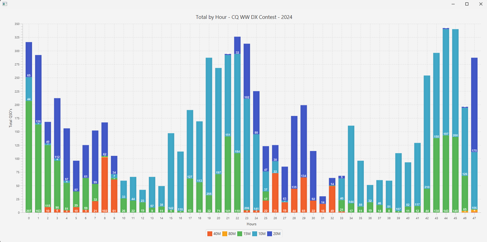
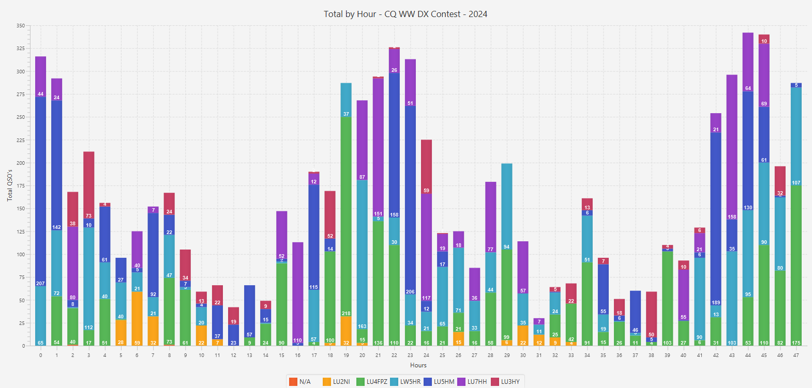

# Contest Analysis Tool

[](https://java.com)
[](https://openjfx.io)
[](https://github.com/yourusername/contest-analysis-tool/blob/main/LICENSE)

A JavaFX application for analyzing contest results and connecting with other software such as DXLog.

## Technologies

This project is built with the following technologies:

- [Java](https://java.com)
- [JavaFX](https://openjfx.io)
- [Maven](https://maven.apache.org/)
- [Hibernate](https://hibernate.org/)
- [H2 Database Engine](https://www.h2database.com/)

## Getting Started

To get started with the Contest Analysis Tool, simply clone this repository:

```bash
git clone https://github.com/ddimunzio/contest-stats.git
```
## Getting Started

To get started with the Contest Analysis Tool, simply clone this repository:


`git clone https://github.com/yourusername/contest-analysis-tool.git`


A JavaFX application for analyzing contest results and connecting with other software such as DXLog.

Contest Analysis Tool
The Contest Analysis Tool is a JavaFX 20 application that allows users to analyze their logs for various contests. The tool uses the Hibernate framework to interact with an H2 database, and it can be connected to other software such as DXLog.

Installation
To run the Contest Analysis Tool, you will need to have the following software installed on your machine:

Java 19 or higher
Maven
Once you have installed the required software, follow these steps:

Clone this repository to your local machine.

Run the following command to build the project:
`mvn clean install`

Run the following command to start the application:

`java --module-path /path/to/javafx-sdk-20/lib --add-modules javafx.controls,javafx.fxml -jar target/contest-analysis-tool.jar
`

_Note: Replace /path/to/javafx-sdk-20 with the path to your JavaFX 20 SDK installation._

Usage
The Contest Analysis Tool is a JavaFX application that provides a user interface for analyzing contest logs. The main features of the application are:

Importing logs from various contest formats
Filtering logs by call sign, frequency, mode, and more
Analyzing logs for various statistics such as QSO count, unique call signs, and multipliers
Generating reports in various formats such as CSV, PDF, and HTML
To use the application, simply launch it from the command line as described in the installation instructions. Once the application is running, you can use the menu and toolbar to perform various tasks such as importing logs, filtering logs, and generating reports.

<H1>Sample Charts</H1>






Configuration
The Contest Analysis Tool uses an H2 database to store log data. The database is created automatically when the application is launched for the first time. By default, the database is stored in the user's home directory in a file named contest-analysis-tool.mv.db.

If you need to customize the database configuration, you can edit the src/main/resources/META-INF/persistence.xml file. This file contains the configuration for the Hibernate framework, including the database connection settings.

Contributing
Contributions to the Contest Analysis Tool are welcome! If you find a bug or have a feature request, please open an issue on the GitHub repository. If you would like to contribute code, please fork the repository and submit a pull request.

License
The Contest Analysis Tool is open source software released under the MIT License. See the LICENSE file for details.
